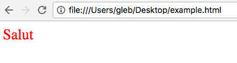

# CSS Intro

## Что такое CSS?

На последнем уроке мы изучили, как создать веб-страницу с помощью HTML. Но HTML - это язык, который определяет структуру документа и не дает нам возможности сделать нашу страницу красивой.

Но прийти на помощь может CSS - каскадные таблицы стилей.

CSS - это стандарт, определяющий способ отображения элементов на нашей странице.

Начнем с того, что мы создаем HTML-документ index.html, который мы будем использовать в качестве базы для вашего сайта.

Ваш HTML-документ будет выглядеть так:

```markup
<!DOCTYPE html>
<html>
<head>    
    <title></title>
</head>
<body>
​
</body>
</html>
```

## Синтаксис CSS

### Селекторы

Для начала нам нужно понять синтаксис CSS.

Это просто и выглядит следующим образом:


Он состоит из селектора и свойств, применяемых к нему в качестве пар ключ-значение. Поскольку селектор может обслуживать различные HTML-элементы, теги, классы и любые комбинации между ними.

Звучит сложно?

Давайте посмотрим пример. Мы создадим новый абзац и зададим цвет текста красным и `25px`. Для этого мы уже использовали известный HTML: мы добавляем тег p в тег body.

```markup
<p>Salut</p>
```

Теперь мы будем cтилизировать HTML с CSS. Для этого добавим специальный тег стиля в голову, описывая стиль, который вы хотите:

```markup
<style type="text/css">    
    p {        
        color: red;
        font-size: 25px    
    }
</style>
```

Теперь откройте файл `index.html` в вашем любимом браузере, и вы увидите следующий результат.



Выглядит лучше, чем без стиля, верно?

### Селекторы, использующие классы

По причине того, что мы выбрали тэг `p` в качестве селектора, любой `p`-тэг в документе HTML будет стилизован с использованием нашего определения CSS. Если мы хотим применить определенный стиль только к элементам, которые имеют некоторые общие свойства, в качестве селектора мы можем взять класс.

  
Например, создайте контейнер `div` c классом `my-class`:

```markup
<div class='my-class'>Hello</div>
```

Затем мы добавим селектор класса `my-class` в тег стиля в HTML:

```css
.my-class {
    background-color: orange;    
    font-size: 30px;
}
```

Обновите страницу браузера и увидите следующий результат:


### Селекторы, использующие ID

В качестве селектора также может использоваться идентификатор \(уникальный идентификатор для любого элемента HTML\).

Чтобы проиллюстрировать это, мы немного изменим `div` в предыдущем примере: вместо атрибута класса мы напишем идентификатор элемента:

```markup
<div id='my-id'>¡Hola!</div>
```

И для стилизации мы добавим селектор для `id`:

```css
#my-id {
    background-color: blue;    
    font-size: 40px;
}
```

В этом примере идентификатор элемента `div` является `my-id`. Обновите страницу в своем браузере и увидите следующий результат:


### Множественный селекторы

До сих пор наши определения стиля были одинаковыми для всех элементов с тем же тегом и классом. Поэтому, чтобы быть более конкретным, мы можем объединить больше селекторов в один.

Например, следующий селектор будет соответствующим образом соответствовать всем элементам класса `my-paragraph-class` родительский элемент которого является элементом `div` с классом `my-class`:

```css
div.my-class .my-paragraph-class {
    color: red;    
    background-color: cian;    
    text-align: center;
}
```

```markup
<div class="my-class">  
    <p class="my-paragraph-class">Bonjour</p>
<div>
```

Вы заметили структуру? Если вы хотите выбрать / установить селектор для дочернего элемента, который находится внутри другого родителя, вам нужно только привязать родительский и дочерний селектор, разделив их пробелом

```css
parent child {
    key: value;
}
```

Подробнее о селекторах можно найти [здесь](https://www.w3schools.com/cssref/css_selectors.asp).

## Как использовать CSS?

Существует 3 способа создания HTML с помощью CSS:

1. Включите CSS во внешний файл с расширением .css \(внешняя таблица стилей\).

   DВы также привяжете документ CSS `style.css` к HTML, использование тег `<link rel="stylesheet" type="text/css" href="style.css">`. внимание на атрибут `href`---он показывает путь к файлу `.css`.  

2. Используете тег `style` в `head` документа HTML \(internal style sheet\):

   ```markup
   <style> 
       p { 
           text-indent: 25px; 
       } 
   </style>
   ```

   Внутри`style` poți lista mai multe declarații de stil.  

3. Folosești atributul `style` pentru fiecare tag din document \(inline style\):

```markup
<p style="text-indent: 25px">Hola!</p>
```

При работе со стилями вы должны помнить два правила:   
1. Для того же селектора применяется последний объявленный стиль;   
2. Каждый метод объявления стиля имеет свой приоритет: встроенный стиль является самым приоритетным, затем следует внутреннему стилю и только в конце внешнего стиля.

## Цвета и фон

Чтобы задать цвет текста, вы можете использовать свойство `color`, которое может получать следующие типы значений:

1. название цвета: `red`, `green`, `blue`;
2. цветной шестнадцатеричный код: `#ff00ff`;
3. код RBG `rgb(255, 0, 0)`.

Например, вы можете установить красный цвет текста тремя способами:

```css
p {
    color: #ff0000;    
    color: rgb(255, 0, 0);    
    color: red;
}
```

Для установки цвета фона элемента используется свойство `background-color`:

```css
div {
    background-color: lightblue;
}
```

### Фоновое изображение? {#imagine-pe-fundal}

Если вы хотите разместить изображение в фоновом режиме, у вас есть свойство `background-image`, где вам нужно указать адрес изображения.

```css
div {
    background-image: url("paper.gif");
}
```

## Стилизация текста и шрифты

### шрифт

Чтобы установить шрифт для текста, вы можете использовать свойство `font-family`.

```css
p {
    font-family: "Times New Roman";
    }
```

Это установит шрифт _Times New Roman_.

Но что, если Times New Roman не установлено на вашем компьютере? Чтобы решить эту проблему, вы можете связать несколько шрифтов:

```css
p {
    font-family: "Times New Roman", Times, serif;
}
```

Теперь вы установите _Times New Roman_ для своего предмета. Если этот шрифт отсутствует на компьютере пользователя, будет применен шрифт _Times_, и если его нет, будет использоваться семейство шрифтов _serif_.

### Размер шрифта

Чтобы контролировать размер шрифта, вы будете иметь свойство `font-size`, в котором вы можете указать в пикселях \(px\) высоту текста:

```css
h1 {
    font-size: 40px;
}
```

Подробнее о шрифтах вы можете узнать [здесь](https://www.w3schools.com/css/css_font.asp).

### Другие свойства

Если вы хотите изменить способ отображения текста, вы можете использовать следующие свойства:

| свойство | описание |
| --- | --- | --- | --- | --- | --- | --- |
| color | Устанавливает цвет текста |
| letter-spacing | Увеличивает или уменьшает пробел между буквами |
| line-height | Устанавливает высоту линии |
| text-align | Указывает горизонтальное выравнивание текста |
| text-decoration | Указывает, как украсить текст |
| text-indent | Устанавливает отступ первой строки текста |

Подробнее о свойствах CSS, которые определяют, как будет выглядеть текст, вы можете узнать [здесь](https://www.w3schools.com/css/css_text.asp).

## Box model {#box-model}


Box model - это концепция, которая позволяет нам легко визуализировать и понимать концепцию поля, заполнения, границы и ширины / высоты элемента HTML.

В "Box model" элемент HTML представлен некоторыми полями, которые:

* margin - расстояние вокруг элемента прозрачно;
* border - граница элемента;
* padding - расстояние между содержимым элемента и границей;
* conținutul - пространство, в котором отображается внутренний текст / изображение.

Высота и длина элемента HTML вычисляются в зависимости от четырех компонентов.

Например, у нас есть элемент со следующими свойствами:

```css
div {
    width: 320px;    
    padding: 10px;    
    border: 5px solid gray;    
    margin: 0; 
}
```

Его ширина будет 350px: 320px + 20px \(левая + правая "padding"\) + 10px \(левая + правая граница\) + 0px \(левое + правое "margin"\).

Подробнее о параметрах свойств box box вы можете [здесь ](https://www.w3schools.com/css/css_margin.asp)и [здесь](https://www.w3schools.com/css/css_padding.asp).

## Позиционирование

До сих пор мы обсуждали, как будут выглядеть элементы страницы, но я не упомянул, в каком порядке они появятся на экране и где должен быть определенный элемент.

Для этих целей в CSS есть позиция собственности. Это указывает метод, с помощью которого элемент HTML будет размещен на странице.

Существует 4 возможных значения для свойства _position_:

* _static --- элемент позиционируется после настройки браузера по умолчанию;_

```css
div.static { 
    position: static; 
    border: 3px solid #73AD21;
}
```


* _relative_---элемент располагается относительно его исходного положения, но занимает зарезервированное пространство;

```css
div.relative {
    position: relative;    
    left: 30px;    
    border: 3px solid red;
}
```


* _absolute_---элемент позиционируется абсолютно относительно первого родителя с относительным положением или, если это не так, с элементом body документа HTML;

```css
div.relative {    
    position: relative;    
    width: 400px;    
    height: 200px;    
    border: 3px solid #73AD21;
} 

div.absolute {    
    position: absolute;    
    top: 80px;    
    right: 0;    
    width: 200px;    
    height: 100px;    
    border: 3px solid #73AD21;
}
```


* _fixed_---указывает фиксированное позиционирование на странице, что означает, что элемент останется постоянным на экране, даже если мы прокрутим.

```css
div.fixed {
    position: fixed;    
    bottom: 0;    
    right: 0;    
    width: 300px;    
    border: 3px solid #73AD21;
}
```


## Плавающие элементы

Хотя у нас уже есть возможность перемещать элементы на странице, очень сложно выровнять элементы по горизонтали.

Легким решением этой проблемы является свойство `float` CSS. Это позволяет создавать плавающие элементы, расположенные бок о бок горизонтально. С помощью этого свойства мы можем создавать галереи изображений, информационные бюллетени и другие предметы.

Таким образом, элементы HTML со свойством `float: left` будут расположены горизонтально один за другим.

```css
.float {    
    width: 100px;    
    height: 100px;    
    border: 1px solid red;    
    margin: 10px;    
    float: left; 
}
```

```markup
<div class='float'></div>
<div class='float'></div>
```


С возможностью размещения элементов по горизонтали возникает проблема со статическими элементами, которые появляются ниже в документе HTML. В частности, если они статичны, они будут перекрываться с плавающими элементами.

Например, если в приведенном выше примере мы добавим элемент после элементов класса float, он будет перекрываться с плавающими элементами.


Чтобы избежать этого совпадения, мы должны приписать элементу следующие плавающие элементы свойство `clear: both`:

```css
.float {    
    width: 100px;    
    height: 100px;    
    border: 1px solid red;    
    margin: 10px;    
    float: left; 
} 

.element {    
    height: 200px;    
    width: 200px;    
    background-color: orange;    
    clear: both; 
}
```

```markup
<div class='float'></div>
<div class='float'></div>
<div class='element'></div>
```


## Полезные ресурсы о CSS

* ​[https://www.w3schools.com/css/default.asp](https://www.w3schools.com/css/default.asp)​
* ​[https://css-tricks.com/](https://css-tricks.com/)​

